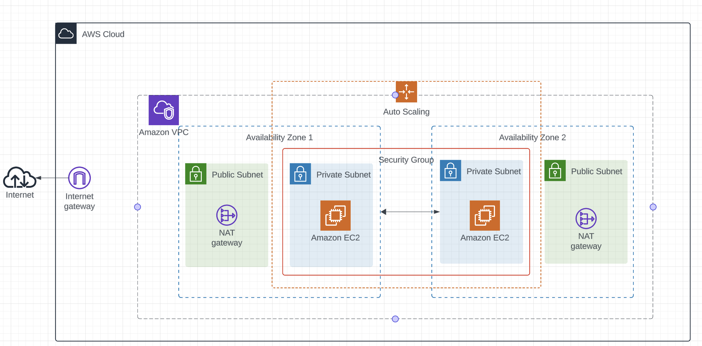

# ND9991 - Course 2 - Infrastructure as Code

This repository contains the starter code for the final project of course 2 Infrastructure as Code in the Cloud DevOps Engineer Nanodegree.

Please note that all supporting material for this course can be found in [this Github repository](https://github.com/udacity/cd12352-Deploy-Infrastructure-as-Code).

# Deploy a high-availability web app using CloudFormation

In this project, you’ll deploy web servers for a highly available web app using CloudFormation. You will write the code that creates and deploys the infrastructure and application for an Instagram-like app from the ground up. You will begin with deploying the networking components, followed by servers, security roles and software.  The procedure you follow here will become part of your portfolio of cloud projects. You’ll do it exactly as it’s done on the job - following best practices and scripting as much as possible. 

## Getting Started

### Dependencies

1. AWS CLI installed and configured in your workspace using an AWS IAM role with Administrator permissions (as reviewed in the course).

2. Access to a diagram creator software of your choice.

3. Your favorite IDE or text editor ready to work.

### Installation

You can get started by cloning this repo in your local workspace:

The project infrastructure can be demonstrated by the below diagram (Created using LucidChart).

The link for the LB DNS name is as follows:
http://udagra-webap-5gxelg8jofrz-879273811.us-east-2.elb.amazonaws.com/

[License](LICENSE.txt)
